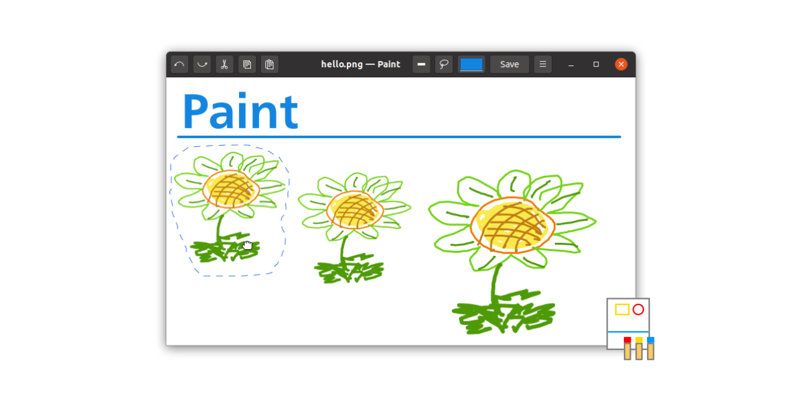

# Paint from Esrille (beta version)

**Paint** from Esrille is a GTK 3 application for drawing bitmap images. Paint is a simple program written in Python.

## Resources

- [User Guide](https://esrille.github.io/paint/)
- [Contributing](https://github.com/esrille/paint/blob/main/CONTRIBUTING.md)
