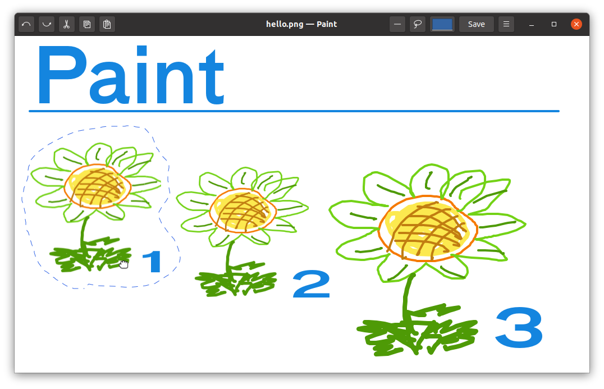

# Introduction

**Paint** from Esrille is a GTK 3 application for drawing bitmap images.
Paint is a simple program written in Python.
The code size of v0.2.0 is about 2,300 lines.

## Contributing

The main repository is hosted at [GitHub](https://github.com/esrille/paint).
The new features being developed are to be listed in the [Issues](https://github.com/esrille/paint/issues) page.

 <small>Copyright 2020 Esrille Inc. </small>
