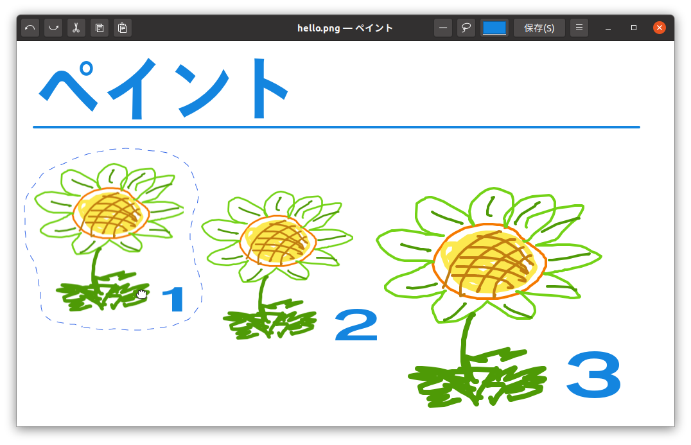

# はじめに

　エスリルでつくっている「ペイント」は、ビットマップ画像がぞうをかくための、GTK 3のアプリケーションソフトです。
Pythonパイソンでかいたシンプルなプログラムです。
バージョン0.1.0のプログラムの行数ぎょうすうは約やく2,200行ぎょうです。

## 「ペイント」の開発かいはつについて

　メインのリポジトリは、[GitHub](https://github.com/esrille/paint)にあります。
開発かいはつ予定よていの機能きのうについては、GitHubの[Issues](https://github.com/esrille/paint/issues)のページでみることができます。

 <small>Copyright 2020 Esrille Inc. </small>
